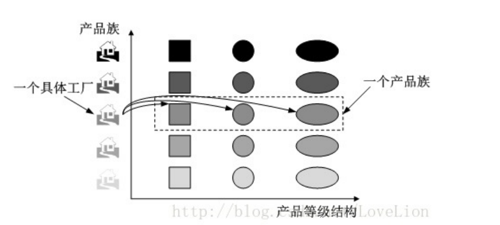
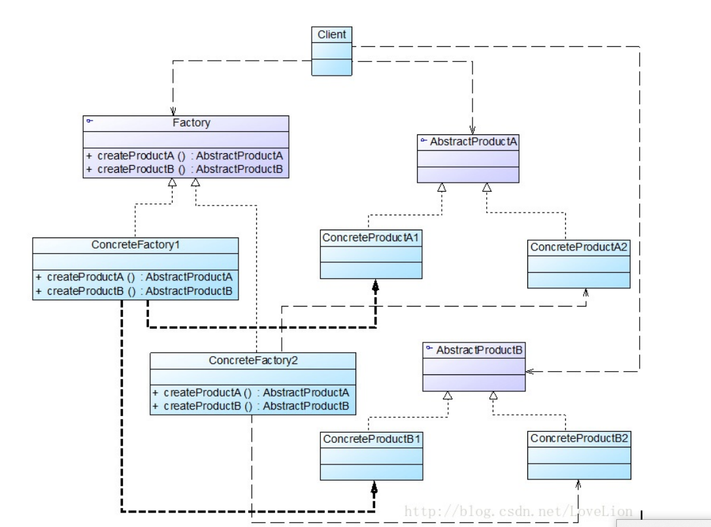

在工厂方法模式中具体工厂负责生产具体的产品，每一个具体工厂对应一种具体产品，工厂方法具有 唯一性，一般情况下，一个具体工厂中只有一个或者一组重载的工厂方法。但是有时候我们希望一个 工厂可以提供多个产品对象，而不是单一的产品对象，如一个电器工厂，它可以生产电视机、电冰 箱、空调等多种电器，而不是只生产某一种电器。为了更好地理解抽象工厂模式，我们先引入两个概 念：(1) 产品等级结构：产品等级结构即产品的继承结构，如一个抽象类是电视机，其子类有海尔电视 机、海信电视机、TCL电视机，则抽象电视机与具体品牌的电视机之间构成了一个产品等级结构，抽 象电视机是父类，而具体品牌的电视机是其子类。 (2) 产品族：在抽象工厂模式中，产品族是指由同一个工厂生产的，位于不同产品等级结构中的一组 产品，如海尔电器工厂生产的海尔电视机、海尔电冰箱，海尔电视机位于电视机产品等级结构中，海 尔电冰箱位于电冰箱产品等级结构中，海尔电视机、海尔电冰箱构成了一个产品族。 产品等级结构与产品族示意图如图所示：

在抽象工厂模式 中，增加新的产品族很方便，但是增加新的产品等级结构很麻烦，抽象工厂模式的这种性质称为“开闭 原则”的倾斜性。“开闭原则”要求系统对扩展开放，对修改封闭，通过扩展达到增强其功能的目的， 对于涉及到多个产品族与多个产品等级结构的系统，其功能增强包括两方面： (1) 增加产品族：对于增加新的产品族，抽象工厂模式很好地支持了“开闭原则”，只需要增加具体产 品并对应增加一个新的具体工厂，对已有代码无须做任何修改。 (2) 增加新的产品等级结构：对于增加新的产品等级结构，需要修改所有的工厂角色，包括抽象工厂 类，在所有的工厂类中都需要增加生产新产品的方法，违背了“开闭原则”。 正因为抽象工厂模式存在“开闭原则”的倾斜性，它以一种倾斜的方式来满足“开闭原则”，为增加新产 品族提供方便，但不能为增加新产品结构提供这样的方便，因此要求设计人员在设计之初就能够全面 考虑，不会在设计完成之后向系统中增加新的产品等级结构，也不会删除已有的产品等级结构，否则 将会导致系统出现较大的修改，为后续维护工作带来诸多麻烦。